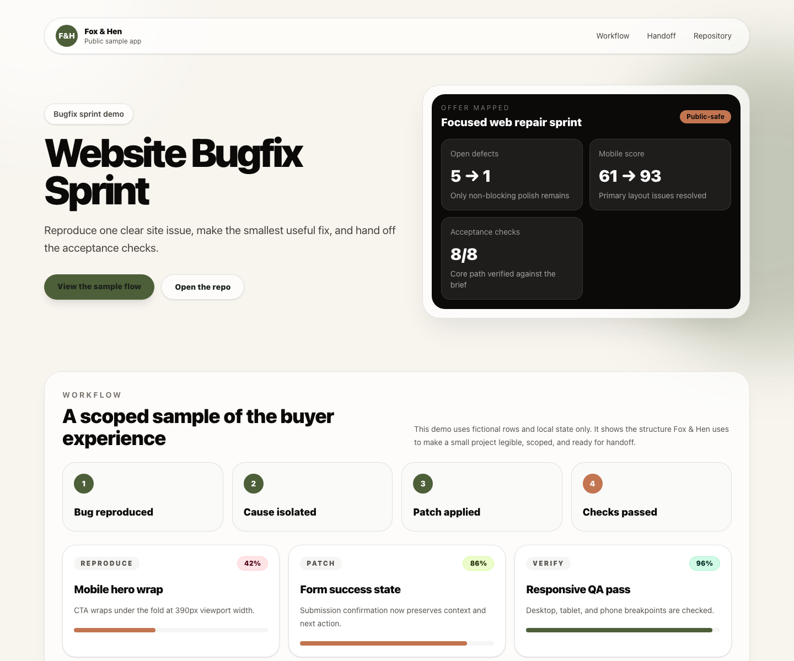

# Website Bugfix Sprint

A static web bugfix sprint board using fictional defects, fix notes, and acceptance checks.

## Service Mapping

- Fox & Hen offer: 24-hour website bug fix or polish pass
- Upwork catalog proof point: Focused web repair sprint
- Live demo: Pending Vercel deployment at `https://foxhen-website-bugfix-sprint.vercel.app`
- Repository: https://github.com/foxandhenllc/foxhen-website-bugfix-sprint

## Screenshot



## What This Demonstrates

- A polished React/Vite/TypeScript interface for a small fixed-scope service.
- A clear intake-to-handoff workflow using fictional sample data.
- Public-safe portfolio proof for Fox & Hen, LLC without real customer data, credentials, or production access.

## Local Run

```bash
npm install --package-lock=false
npm run dev
```

## Build

```bash
npm run build
```

## Scope Note

This repository is a public sample app. It uses local static data only and does not require environment variables, accounts, payments, databases, or third-party services.
